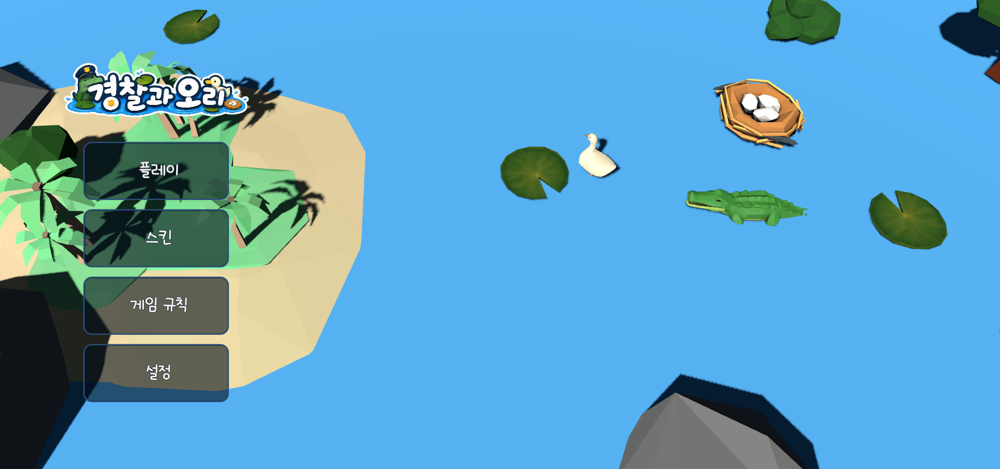

# 26s-w2-c3-02

## 공통과제 II : 협업형 실전 산출물 제작 (2인 1팀)

**목적:** 실시간 인터랙션, LLM Wrapper, Cross-Platform 중 하나의 옵션을 선택해 구현하며, 선택한 기술을 실제로 동작하는 형태의 산출물로 완성한다.

**선택 옵션:**

| 옵션 | 설명 |
|---|---|
| 실시간 인터랙션 | 사용자 간 상태 변화, 실시간 데이터 흐름, 스트리밍 응답 등 실시간성이 드러나는 기능을 구현 |
| LLM Wrapper | LLM API를 활용하여 AI 기능이 포함된 산출물을 구현 |
| Cross-Platform | 하나의 산출물을 여러 실행 환경에서 사용할 수 있도록 구현* |

> *데스크톱 앱 ↔ 모바일 앱; 혹은 다른 폼팩터에서의 앱; 웹만/웹 기반 프레임워크(Electron, Tauri 등) 대신 다른 프레임워크를 시도해보는 것을 적극 권장

**결과물:** 선택한 옵션이 적용된 작동 가능한 산출물, 실행 가능한 코드, 시연 자료 및 관련 문서

---

## 팀원

| 이름 | 학교 | GitHub | 역할 |
|---|---|---|---|
| 박수현 | 한양대학교 | [suh1088](https://github.com/suh1088) | 클라이언트 B 트랙 (Godot, 인게임 월드·캐릭터·새끼오리) |
| 조예준 | KAIST | [jossi-jossi](https://github.com/jossi-jossi) | 클라이언트 A 트랙 (Godot, 화면 흐름·메뉴·HUD) → 이후 네트워크/백엔드 (Node.js, 웹소켓 동기화) |

> 서버 착수 전까지는 [Docs/Plan.md](Docs/Plan.md)의 클라이언트 병렬 개발 계획을 따른다: 박수현이 B 트랙(인게임 월드·캐릭터), 조예준이 A 트랙(화면 흐름·UI)을 담당한다.

---

## 선택 옵션

- [x] 실시간 인터랙션
- [ ] LLM Wrapper
- [x] Cross-Platform

---

## 기획안

- **산출물 주제:** 악어(술래)와 오리(도망자)가 3D 연못 위에서 대결하는 실시간 멀티플레이 경찰과 도둑잡기 게임
- **제작 목적:** Godot + WebSocket 기반 실시간 위치/상태 동기화를 구현하고, 하나의 코드베이스로 PC 웹과 모바일 앱을 동시 대응하는 크로스플랫폼 게임을 완성한다
- **선택 옵션:** 실시간 인터랙션, Cross-Platform
- **핵심 구현 요소:**
  - 오리(도망자) / 악어(술래·경찰) 역할 기반 실시간 멀티플레이 동기화 (위치, 포획, 구출, 새끼오리 획득 상태)
  - 가로 모드 고정 + Anchor/Safe Area 기반 반응형 UI로 PC 웹·모바일 앱 동시 대응
  - 연못 위 새끼오리 스폰 및 둥지 인솔, 감옥/구출 기믹을 포함한 게임 규칙 구현
- **사용 / 시연 시나리오:** 플레이어가 방을 만들거나 방 코드로 참가 → 로비에서 캐릭터(오리/악어 스킨) 선택 및 준비 → 게임 시작 시 서버가 오리/술래 역할을 무작위 배정 → 오리는 제한 시간 내 새끼오리를 둥지로 인솔, 악어(술래)는 오리를 체포해 감옥에 가두며 방해 → 시간 종료 또는 승리 조건 달성 시 결과 화면에서 승패 및 개인 기록 확인
- **팀원별 역할:** 박수현(클라이언트 B 트랙 - 인게임 월드·캐릭터·새끼오리, 3D 에셋 배치), 조예준(클라이언트 A 트랙 - 화면 흐름·메뉴·HUD·반응형 UI, 이후 Node.js 서버 구축·웹소켓 동기화·서버 배포)

### 개발 일정

| 날짜 | 목표 |
|---|---|
| Day 1 | 문서 작성 & 개발환경 세팅 |
| Day 2 | Kenney 에셋으로 3D 연못 배치, 클릭/터치 방향 이동 조작계 구현 |
| Day 3 | 새끼오리 스폰·인솔·둥지 점수 등 싱글 플레이 핵심 로직 완성 |
| Day 4 | 술래(악어) 조작 및 체포·감옥(대시 잡기) 기믹 구현, Node.js 웹소켓 서버 기초 세팅 |
| Day 5 | 실시간 위치 동기화 (Godot ↔ Node.js WebSocket) |
| Day 6 | 오브젝트/상태 동기화(포획·구출·새끼오리 획득) 및 데이터 꼬임 버그 디버깅 |
| Day 7 | 가로 모드 반응형 UI 마무리, 웹/서버 배포 및 크로스플랫폼 최종 QA |

---

## 구현 명세서

| 구현 요소 | 설명 | 우선순위 |
|---|---|---|
| 실시간 위치/상태 동기화 | 오리·악어(술래)의 이동, 포획, 구출, 새끼오리 획득 상태를 WebSocket으로 모든 클라이언트에 실시간 반영 | 필수 |
| 크로스플랫폼 반응형 UI | PC 웹과 모바일 앱에서 가로 모드 고정, Anchor/Safe Area 기반 UI로 동일하게 동작 | 필수 |
| 오리 & 악어 스킨 선택 | 로비에서 캐릭터 외형(스킨)을 선택할 수 있는 커스터마이징 기능 | 선택 |
| 대기방(로비) 화면 | 참가자 목록, 준비 상태, 방 코드/초대 기능을 갖춘 로비 화면 | 선택 |
| 대시 체포 판정 | 술래가 대시(가속 돌진)로 판정 폭(`DASH_CATCH_HALF_WIDTH`) 안의 오리를 체포, 쿨다운(5초) 적용 | 필수 |
| 감옥 / 자동 탈출 | 체포된 오리는 감옥으로 이동, 오리가 1명만 남았을 때만 일정 시간(8초) 후 자동 탈출 | 필수 |
| 협동 구출 | 감옥 반경 안에서 일정 시간(3초) 머물면 진행도(`rescueProgress`)가 쌓여 갇힌 오리를 구출 | 필수 |
| 새끼오리 스폰/배회 | 맵 내 최대 10마리 유지, 블루노이즈 방식으로 서로 겹치지 않게 배치 후 랜덤 배회(장애물 회피) | 필수 |
| 새끼오리 인솔/배달 | 오리가 근접(`PICKUP_DISTANCE`) 시 새끼오리를 줍고 대열로 데려가 둥지 근처(`DELIVER_DISTANCE`)에서 배달 | 필수 |
| 동적 목표 점수 | 목표 점수를 오리 인원수에 비례(오리 수 × 8)해 게임 시작 시 재계산 | 필수 |
| 라운드 종료 조건 | 시간 종료(180초) / 목표 점수 달성 / 오리 전원 수감 중 하나로 승패 판정 | 필수 |
| 카운트다운 시작 | 전원 준비(ready) 완료 시 10초 카운트다운 후 게임 시작 | 선택 |
| 공개/비공개 방 & 참가 코드 | 방 목록에서 공개방은 바로 참가, 비공개방은 4자리 참가 코드로만 입장 | 선택 |

---

## 아키텍처

<!-- 실시간 인터랙션: WebSocket/SSE/WebRTC 구조도 / LLM Wrapper: API 연동 흐름도 / Cross-Platform: 플랫폼 구성도 -->

- **클라이언트:** Godot Engine (GDScript) → PC 웹(WebGL/WASM 빌드) & 모바일 앱으로 동일 코드베이스 내보내기
- **서버:** Node.js + `ws` 라이브러리 기반 순수 웹소켓 서버, 방(room) 단위 인메모리 상태 관리
- **통신:** 클라이언트 ↔ 서버 간 JSON 메시지 기반 WebSocket 양방향 통신 (위치 갱신, 포획/구출 판정, 새끼오리 획득 이벤트 브로드캐스트)
- **배포:** Godot Web(WASM) 빌드(`web/`)를 GitHub Actions로 **GitHub Pages**에 자동 배포(커스텀 도메인 `cop-and-ducks.art`). Node.js 서버는 **Docker 이미지**로 빌드해 GitHub Actions(SSH)로 **AWS EC2**에 배포하며, 클라이언트는 `wss://cops-and-ducks.madcamp-kaist.org/ws`로 접속한다. EC2 컨테이너 이미지에는 웹 빌드(`web/`)도 함께 담겨 있어, 필요 시 정적 파일과 WebSocket을 같은 origin에서 서빙할 수 있다.

---

## 설계 문서

> 프로젝트 성격에 따라 필요한 항목만 작성

### 화면 / 인터페이스 설계

<!-- Figma 링크, 화면 이미지, CLI 사용 예시, 앱 화면 등 -->

전체 IA(정보 구조):

```
게임 실행
├─ 로딩
├─ 메인 화면
│  ├─ 빠른 참가 / 방 만들기 / 방 코드 참가
│  ├─ 캐릭터 꾸미기
│  └─ 설정
├─ 로비
│  ├─ 참가자 목록 / 준비 상태 / 방 설정
│  ├─ 초대 / 방 코드
│  └─ 게임 시작
├─ 역할 안내 (오리 역할 / 술래 역할)
├─ 인게임
│  ├─ 일반 플레이 / 오리 새끼 인솔 / 체포 시도
│  ├─ 수감 상태 / 구출 상태
│  └─ 일시정지 / 연결 끊김
└─ 결과 화면
   ├─ 승리 / 패배 / 개인 기록
   └─ 다시 하기 / 로비로 돌아가기 / 메인 화면
```

화면 레이아웃은 가로 모드 고정, 좌측 이동 입력 / 중앙 게임 시야 / 우측 행동 버튼 3분할 구조를 기준으로 하며, 상단 상태 바(남은 시간, 목표 진행도)는 Safe Area 안쪽에 배치한다.

### 데이터 구조

<!-- DB 스키마, JSON 구조, 파일 저장 방식 등 -->

별도 DB 없이 Node.js 서버 인메모리(`Map<roomId, Room>`)로 방 단위 상태를 관리한다. 서버는 매 틱 시뮬레이션 후 아래 형태의 `game:state`를 같은 방 전체에 브로드캐스트한다(30Hz). 판정과 무관한 장식 오브젝트(물고기·연잎·물결 등)는 동기화하지 않고 각 클라이언트가 로컬로 처리하며, 운반 중(`carried`) 새끼오리의 좌표도 서버 판정에 쓰이지 않으므로 순서(`queueIndex`)만 내려주고 실제 대열 좌표는 각 클라이언트가 로컬 계산한다.

```json
{
  "roomId": "0427",
  "phase": "lobby | countdown | playing | ended",
  "remainingSeconds": 180,
  "score": 3,
  "targetScore": 16,
  "winner": null,
  "endReason": null,
  "players": [
    {
      "playerId": "uuid",
      "nickname": "Player",
      "team": "duck | tagger",
      "character": "duck | aligator",
      "position": { "x": 0, "y": 0, "z": 0 },
      "rotationY": 0.0,
      "state": "idle | jailed",
      "deliveredDucklings": 2
    }
  ],
  "ducklings": [
    {
      "ducklingId": "d1",
      "position": { "x": 0, "y": 0, "z": 0 },
      "state": "spawned | carried | delivering | delivered",
      "carrierPlayerId": null,
      "queueIndex": 0
    }
  ]
}
```
---
### 🔌 API 문서

실시간 통신은 JSON 메시지 기반 WebSocket(`/ws`) 한 채널로 이루어지며, 별도 인증 없이 연결 시 전달하는 `roomId`로 방을 구분합니다. 각 메시지는 `type` 필드로 종류를 구분합니다.

<details>
<summary><strong>연결 / 방</strong></summary>

| Method / 방식 | Endpoint / type | 설명 | 요청 | 응답 |
|---|---|---|---|---|
| WebSocket | `/ws` | 서버 연결 | query `roomId?, nickname` | `{ type: "connected", playerId }` |
| WS type | `room:create` | 방 생성 | `{ type, payload: { nickname } }` | `{ type, requestId, payload: { roomId } }` |
| WS type | `room:list` | 참가 가능한 방 목록 조회 | `{ type, requestId }` | `{ type, requestId, payload: { rooms } }` |
| WS type | `room:join` | 방 참가 | `{ type, roomId, payload: { nickname } }` | 요청자 `room:joined` + 전체 `room:state` 브로드캐스트 |
| WS type | `game:start` | 게임 시작 | `{ type, roomId }` | 전체 `game:state` 브로드캐스트 |
| WS type | `ping` | 유휴 연결 유지 (30초 주기) | `{ type: "ping" }` | `{ type: "pong" }` |

</details>

<details>
<summary><strong>인게임 동기화</strong></summary>

| Method / 방식 | Endpoint / type | 설명 | 요청 | 응답 |
|---|---|---|---|---|
| WS type | `player:input` | 플레이어 이동 입력 동기화 | `{ type, roomId, payload: { position, direction } }` | 같은 방 `game:state` 브로드캐스트 |
| WS type | `player:dash` | 플레이어 대시(가속) 동작 | `{ type, roomId, payload: { direction } }` | 같은 방 `game:state` 브로드캐스트 |
| WS type | `player:catch` | 거위가 오리 체포 | `{ type, roomId, payload: { targetId } }` | 같은 방 `game:state` 브로드캐스트 (`targetId` → jailed) |
| WS type | `player:rescue` | 감옥에 갇힌 오리 구출 | `{ type, roomId, payload: { targetId } }` | 같은 방 `game:state` 브로드캐스트 (`targetId` → normal) |
| WS type | `duckling:deliver` | 새끼오리 둥지 반납(점수) | `{ type, roomId, payload: { ducklingId } }` | 같은 방 `game:state` 브로드캐스트 |

</details>

<details>
<summary><strong>오류</strong></summary>

| Method / 방식 | Endpoint / type | 설명 | 요청 | 응답 |
|---|---|---|---|---|
| WS type | `error` | 요청 처리 실패 시 응답 | - | `{ type: "error", requestId, payload: { code, message } }` |

</details>

---

## 산출물 및 실행 방법

- **산출물 설명:** 악어(경찰)가 술래, 오리가 도망자가 되어 3D 연못 위에서 새끼오리 구출/체포를 겨루는 실시간 멀티플레이 캐주얼 게임
- **실행 환경:** PC 웹 브라우저(WASM) / 모바일 앱(Android), Node.js 웹소켓 서버
- **실행 방법:** 배포된 웹 링크 접속 또는 모바일 앱 실행 → 방 만들기/참가 → 로비에서 준비 완료 → 게임 시작
- **시연 영상 / 이미지:**

| 메인화면 | 게임 목록 |
|---|---|
|  |  |

| 스킨 | 대기실 화면 |
|---|---|
|  |  |

| 인게임 |
|---|
|  |

### 실행 방법

단순 실행: https://madcamp-official.github.io/26s-w2-c3-02/

```bash
# 1) 서버 (Node.js + ws) — 기본 ws://localhost:8080/ws
cd server
npm install
npm run dev        # node --watch src/index.js (파일 변경 시 자동 재시작)
# npm start        # 프로덕션 실행
# npm run smoke-test  # 방 생성→참가→시작→획득→반납→대시 수감까지 자동 점검

# 2) 클라이언트 (Godot 4.7)
# Godot 4.7 에디터로 client/project.godot 열고 F5로 실행.
# 로컬 서버에 붙이려면 client/scripts/autoload/MockServer.gd 의
#   SERVER_URL 을 "ws://127.0.0.1:8080/ws" 로 바꾼다(기본값은 배포 서버).
# 웹 빌드: Project > Export > "Web" 프리셋으로 web/index.html 내보내기.

# (선택) Docker로 서버+웹 한 번에
docker compose up --build   # http/ws 모두 8080 포트
```

> 서버 포트는 `PORT` 환경변수로 바꿀 수 있고(`PORT=9000 npm run dev`), 헬스체크는 `GET /healthz` → `200 ok`. 별도 `.env` 파일이나 외부 API 키는 필요 없다.

### 기술 구성

| 분류 | 사용 기술 |
|---|---|
| 핵심 기술 | Godot Engine (GDScript), Node.js, WebSocket (`ws`) |
| 실행 환경 | PC 웹(WASM), 모바일 앱(Android), Node.js 서버 |
| 데이터 저장 | 인메모리 (Node.js `Map<roomId, Room>`), 별도 DB 미사용 (추후 필요 시 Redis 검토) |
| 외부 API / 서비스 | 없음 (프로토타입 단계 미도입) |
| 기타 | Kenney / Sketchfab / Poly Pizza 무료 3D 에셋(.gltf/.glb), GitHub Pages(웹, 커스텀 도메인) + AWS EC2 Docker(서버) 배포, GitHub Actions CI/CD |

---

## 회고 문서

> [KPT 방법론 참고](https://velog.io/@habwa/%EB%8B%A8%EA%B8%B0-%ED%94%84%EB%A1%9C%EC%A0%9D%ED%8A%B8-%ED%9A%8C%EA%B3%A0-KPT-%EB%B0%A9%EB%B2%95%EB%A1%A0)

### Keep — 잘 된 점, 다음에도 유지할 것

- 시작 전 원하는 방향에 대한 문서 작성
- 처음부터 완벽하게 하려 하지 않고 일단 만들어보고 고치는 방법론
- 여러 세션을 이용해서 개발속도 향상
- 배포 파이프라인 구축
- 개발 과정부터 다른 분반원과 지속적인 피드백

### Problem — 아쉬웠던 점, 개선이 필요한 것

- 처음부터 마음만 앞서서 에셋을 추가하다 보니 디버깅에 어려움이 있었음
- UI 레이아웃을 잡지 않고 개발 시작해서 수정이 잦았음
- 게임 엔진 사용법이 익숙하지 않은데도 무작적 AI 믿고 개발 시작해서 프롬프트를 모호하게 작성함

### Try — 다음번에 시도해볼 것

- 일주일치 계획을 세우고 시작하는 것.
- 파일 구조의 소유권을 나눠서 깃 충돌 방지
- 전체적인 UI 틀을 피그마로 잡고 개발 시작

### 팀원별 소감

**박수현:**

> 개발 프로세스는 그 분야의 현업에서 실제로 사용하는 프로세스를 그대로 따라가면서 상황에 맞게 조금씩 바꾸는게 좋다. 처음부터 내 맘대로 에셋 적용하고 시작하니까 나중에 최적화가 너무 힘들다. 게임 처음 만들어보지만 나름 괜찮게 나온 것 같다

**조예준:**

> 

---

## 참고 자료

### 실시간 인터랙션

**WebSocket**
- https://developer.mozilla.org/en-US/docs/Web/API/WebSockets_API
- https://techblog.woowahan.com/5268/
- https://tech.kakao.com/posts/391
- https://daleseo.com/websocket/
- https://kakaoentertainment-tech.tistory.com/110

**Socket.IO**
- https://socket.io/docs/v4/
- https://inpa.tistory.com/entry/SOCKET-%F0%9F%93%9A-Namespace-Room-%EA%B8%B0%EB%8A%A5
- https://adjh54.tistory.com/549
- https://fred16157.github.io/node.js/nodejs-socketio-communication-room-and-namespace/

**SSE (Server-Sent Events)**
- https://developer.mozilla.org/en-US/docs/Web/API/Server-sent_events
- https://developer.mozilla.org/ko/docs/Web/API/Server-sent_events/Using_server-sent_events
- https://api7.ai/ko/blog/what-is-sse

**TCP / UDP Socket**
- https://docs.python.org/3/library/socket.html
- https://inpa.tistory.com/entry/NW-%F0%9F%8C%90-%EC%95%84%EC%A7%81%EB%8F%84-%EB%AA%A8%ED%98%B8%ED%95%9C-TCP-UDP-%EA%B0%9C%EB%85%90-%E2%9D%93-%EC%89%BD%EA%B2%8C-%EC%9D%B4%ED%95%B4%ED%95%98%EC%9E%90

**gRPC Streaming**
- https://grpc.io/docs/what-is-grpc/core-concepts/
- https://tech.ktcloud.com/entry/gRPC%EC%9D%98-%EB%82%B4%EB%B6%80-%EA%B5%AC%EC%A1%B0-%ED%8C%8C%ED%97%A4%EC%B9%98%EA%B8%B0-HTTP2-Protobuf-%EA%B7%B8%EB%A6%AC%EA%B3%A0-%EC%8A%A4%ED%8A%B8%EB%A6%AC%EB%B0%8D
- https://tech.ktcloud.com/entry/gRPC%EC%9D%98-%EB%82%B4%EB%B6%80-%EA%B5%AC%EC%A1%B0-%ED%8C%8C%ED%97%A4%EC%B9%98%EA%B8%B02-Channel-Stub
- https://inspirit941.tistory.com/371
- https://devocean.sk.com/blog/techBoardDetail.do?ID=167433

**WebRTC**
- https://developer.mozilla.org/en-US/docs/Web/API/WebRTC_API
- https://webrtc.org/getting-started/overview
- https://web.dev/articles/webrtc-basics?hl=ko
- https://devocean.sk.com/blog/techBoardDetail.do?ID=164885
- https://beomkey-nkb.github.io/%EA%B0%9C%EB%85%90%EC%A0%95%EB%A6%AC/webRTC%EC%A0%95%EB%A6%AC/
- https://gh402.tistory.com/45
- https://on.com2us.com/tech/webrtc-coturn-turn-stun-server-setup-guide/

**QUIC / WebTransport**
- https://developer.mozilla.org/en-US/docs/Web/API/WebTransport_API
- https://datatracker.ietf.org/doc/html/rfc9000
- https://news.hada.io/topic?id=13888

#### KCLOUD VM / Cloudflare Tunnel 환경별 주의사항

| 환경 | 사용 가능(권장) 기술 | 포트/조건 | 주의할 기술 |
|---|---|---|---|
| **로컬 / 일반 VM** | HTTP/REST, WebSocket, Socket.IO, SSE, TCP Socket, gRPC Streaming, WebRTC, QUIC/WebTransport 등 대부분 가능 | 직접 포트 개방 가능. 예: 3000, 5000, 8000, 8080, 9000 등. 외부 공개 시 방화벽/보안그룹/공인 IP 설정 필요 | WebRTC는 STUN/TURN 필요 가능. QUIC/WebTransport는 HTTP/3 · UDP 지원 필요 |
| **KCLOUD VM (VPN 내부)** | HTTP/REST, WebSocket, Socket.IO, SSE, WebRTC 시그널링 | 접속 기기 VPN 필요. 기본 허용 포트: **22, 80, 443**. 개발 포트(3000, 8000, 8080 등)는 직접 접근 제한 가능 | TCP Socket은 포트 제한 있음. gRPC는 HTTP/2 설정 필요. WebRTC 미디어·UDP·QUIC/WebTransport 비권장 |
| **KCLOUD VM + Tunnel** | HTTP/REST, WebSocket, Socket.IO, SSE, WebRTC 시그널링 | VM의 `localhost:<port>`를 도메인에 연결. `localPort`는 **1024~65535**. 예: 3000, 8000, 8080 가능 | 순수 TCP Socket, UDP, WebRTC 미디어/DataChannel, QUIC/WebTransport 불가. gRPC 보장 어려움 |
| **외부 서비스 + 우리 도메인** | HTTP/REST, WebSocket, Socket.IO, SSE, WebRTC 시그널링 | Vercel/Netlify/Railway/Render/AWS/GCP 등에 배포 후 CNAME/A 레코드 연결. 보통 외부는 **443** 사용 | WebSocket/gRPC/TCP/UDP는 플랫폼 지원 여부 확인 필요. 서버리스 플랫폼은 장시간 연결 제한 가능 |
| **서버 없이 외부 SaaS 사용** | Supabase Realtime, Firebase, Pusher/Ably, LLM API Streaming | 직접 포트 관리 불필요. 각 서비스 SDK/API 사용 | 커스텀 TCP/UDP 서버 구현 불가. WebRTC는 STUN/TURN 필요할 수 있음 |

### LLM Wrapper

- https://github.com/teddylee777/openai-api-kr
- https://github.com/teddylee777/langchain-kr
- https://devocean.sk.com/blog/techBoardDetail.do?ID=167407
- https://mastra.ai/docs

### Cross-Platform

- https://flutter.dev/
- https://reactnative.dev/
- https://docs.expo.dev/
- https://kotlinlang.org/multiplatform/
